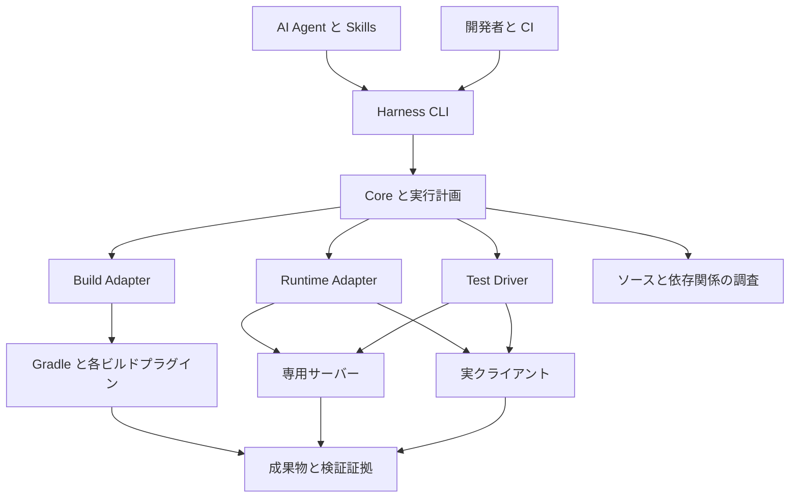

# Minecraft Mod 開発向け AI Agent ハーネス実装計画書

作成日: 2026-09-30  
状態: フェーズ1〜6の実装・受け入れ検証完了。Windows と WSL Ubuntu / WSLg で全4ターゲットの必須88ケースを確認。GitHub Actions / Xvfb の実実行と npm 公開は未実施。

本計画は、Minecraft Java Edition の Mod を AI Agent と開発者が同じ手順でビルドし、実クライアントと専用サーバーで検証できるハーネスを作るためのもの。対象は Minecraft 1.20.1 以降とし、Windows を最初の開発・実行環境にする。Linux への展開と共同開発者への配布を初期設計に含める。

共通 CLI に実行管理と結果収集を集約し、Skill、ビルド接続部、ゲーム実行・テスト接続部を分離する。調査の根拠は [RESEARCH.md](./references/RESEARCH.md) にある。本書は実装の基準であり、実際のインターフェースと検証範囲は README.md と docs/ を参照する。

## 目的と対象範囲

開発ループを「対象を選ぶ → 対象版の API を調べる → 実装する → ビルドする → テストする → 証拠を保存する」に統一する。Agent、開発者、CI が同じ CLI と設定を使い、結果から再実行条件を特定できる状態を目指す。

対象に含めるものは次のとおり。

- 複数 Minecraft バージョンと Fabric、Forge、NeoForge のターゲット管理。
- 既存 Mod プロジェクトへの接続と、新規開発向けの推奨テンプレート。
- ビルド、単体テスト、データ生成、GameTest、配布 JAR の起動確認。
- 実クライアントから専用サーバーへの接続、操作、状態・同期の検証。
- ログ、画像、テスト結果、成果物のハッシュ、再現条件の保存。
- Windows と Linux の差分の局所化、npm 配布、同梱 Skills、CI 連携。

ゲームバランス分析、進行グラフ、レシピコスト評価は今回の対象外とする。将来の専用 Mod は、通常の補助 Mod と同じ配備・実行・成果物収集の仕組みに接続できればよい。バランス専用のスキーマや分析器は先行実装しない。

また、初期リリースでは全バージョンへの自動対応、全ローダーを統合した単一配布 JAR、汎用 GUI テスト言語、独自ランチャー、独自 MCP サーバーを必須にしない。

## 基本方針

| 項目 | 方針 | 理由 |
| --- | --- | --- |
| 実行の入口 | TypeScript と Node.js による共通 CLI | JSON、外部プロセス、既存ツール接続、npm 配布をまとめる |
| ゲーム内コード | Java | 各ローダーの開発環境とテスト API を使う |
| Skill | CLI を呼び出す手順と判断基準 | OS 別スクリプトや状態管理を Skill ごとに重複させない |
| 対応範囲 | 明示的なターゲット一覧 | バージョンとローダーの全直積を対応扱いにしない |
| ビルド | プロジェクトの Gradle Wrapper と設定を尊重 | 特定テンプレートへの依存を避ける |
| 実行環境 | 実行単位で隔離 | ワールド、設定、Mod、ログの混入を防ぐ |
| 検証 | 開発環境と配布 JAR の両方で実施 | 開発用 classpath だけでは配布後の不具合を検出できない |
| 結果 | 共通スキーマと証拠ファイル | バックエンドが異なっても判定と再現方法を揃える |
| 外部ツール | Adapter 経由で採用 | 更新や対応範囲の不足を本体から切り離す |
| 配布 | 初期は一つの npm パッケージ | 内部境界を保ちながら導入・版管理を簡単にする |

Node.js の対応メジャー版と各依存パッケージの具体的な版は、PoC で互換性を確認して固定する。実行時に無条件で最新版を取得する設計にはしない。

## 対応ターゲット

初期の対応目標は次の4組とする。これは検証予定の一覧であり、動作確認済みの一覧ではない。

| ターゲット ID | Minecraft | ローダー | ゲーム用 Java の初期候補 | 主な検証目的 |
| --- | --- | --- | --- | --- |
| fabric-1.21.1 | 1.21.1 | Fabric | 21 | 最初の開発ループを完成させる |
| neoforge-1.21.1 | 1.21.1 | NeoForge | 21 | ローダー差を吸収する |
| fabric-1.20.1 | 1.20.1 | Fabric | 17 | 対応下限への移植を検証する |
| forge-1.20.1 | 1.20.1 | Forge | 17 | Forge 系の旧ビルド・実行構成を検証する |

1.20.1 の Forge 系は Forge を優先する。NeoForge 公式も同版では Forge の使用を推奨している。[NeoForge User Guide](https://docs.neoforged.net/user/docs/)

「1.20.1 以降」は追加可能な対象範囲を示す。中間版や将来版を自動的にサポートしたことにはしない。新規ターゲットは依存解決、ビルド、必須テスト、対応 OS の検証が完了した時点で追加する。

Java は次の三つを区別して管理する。

- Gradle 自体を起動する Java。
- コンパイルに用いる Java toolchain と出力バイトコードの条件。
- Minecraft クライアント・サーバーを起動する Java。

ゲーム用 Java だけから Gradle 用 Java を決めない。1.20.5 の Java 21 要件や 26.1 の Java 25 要件のような変化にも、ターゲット情報の追加で対応する。[Fabric 1.20.5 の変更](https://fabricmc.net/2024/04/19/1205.html)、[NeoForge 開発要件](https://docs.neoforged.net/docs/gettingstarted/)

## 全体構成



| 部品 | 責務 | 境界 |
| --- | --- | --- |
| Core | 設定検証、実行計画、セッション、資源制限、結果集約 | 個別ローダーの API やタスク名を埋め込まない |
| Build Adapter | タスク実行、配布 JAR、ソース、classpath、依存情報の取得 | ゲーム内の操作を担当しない |
| Runtime Adapter | インスタンス準備、Mod 配備、起動、準備完了確認、停止 | テストの合否は Test Driver と Core に返す |
| Test Driver | GameTest、操作、状態照会、スクリーンショット、アサーション | 起動済みセッションを利用し、プロセス管理を重複させない |
| Inspection Provider | 対象版のソース検索、依存調査、診断 | 調査機能が使えなくても通常のビルドを妨げない |
| Platform | OS 固有の起動・終了、パス、画面環境 | テスト仕様やローダー差を持ち込まない |
| Skills | 準備、実装、検証、移植、障害調査の手順 | 外部ツールの詳細を Agent が都度推測しなくてよい形にする |

Adapter の初期契約は、Build が `inspect / build / collectArtifacts`、Runtime が `prepare / start / waitReady / stop / collectEvidence`、Test Driver が `capabilities / runSuite` を提供する形とする。具体的な型はフェーズ1で定義する。外部公開する汎用プラグイン API は、複数の実装で境界を検証してから安定化する。

## Mod プロジェクトの構成

ローダー差と Minecraft バージョン差を分離する。

| ソースの種類 | 管理方針 |
| --- | --- |
| Minecraft に依存しないロジック | 純粋な Java として共有し、通常の単体テストを行う |
| Minecraft の共通処理 | common 相当のソース群へ置く |
| 登録、イベント、通信、設定、固有連携 | Fabric、Forge、NeoForge ごとの実装へ分離する |
| 小規模なバージョン差 | Stonecutter の条件分岐などで吸収する |
| 大きな API やビルド基盤の差 | バージョン群ごとのソースまたは独立した Gradle ビルドへ分離する |

新規開発向けテンプレートでは、[MultiLoader Template](https://github.com/jaredlll08/MultiLoader-Template) の責務分離を参考にし、複数版の管理に Stonecutter を採用する方針で PoC を行う。[Stonecutter の Fabric と NeoForge テンプレート](https://github.com/stonecutter-versioning/stonecutter-template-multiloader)は参考実装とし、Forge 1.20.1 を含む構成を別途確認する。

ハーネスは複数のビルドルートを扱えるようにし、すべての版を一つの Gradle Wrapper やプラグイン構成に押し込まない。既存の Architectury 構成や版別プロジェクトも、タスク・成果物の対応設定から接続する。

Stonecutter などのソース切り替えが作業ツリーを書き換える場合、同じ作業ツリー内の操作は直列化する。並列実行が必要な場合は独立した作業コピーで行い、Agent の編集と版切り替えを競合させない。

Agent の API 調査では、選択したターゲットの実際の classpath、マッピング、ソースを利用する。最新版のドキュメントの例を旧版へ無条件に適用しない。

## 設定と成果物の契約

### 用語

- ターゲット: Minecraft、ローダー、依存関係、ビルド対応を特定する単位。
- 実行構成: 専用サーバーのみ、シングルプレイ、専用サーバーと一つ以上のクライアントなどの構成。
- Suite: 必要な能力、実行構成、テストケース、期待結果をまとめた検証単位。
- Run: 一回の実行計画とその結果。複数ターゲットを含む場合も各結果を分離する。

### 設定ファイル

| ファイル | 内容 | Git 管理 |
| --- | --- | --- |
| harness.config.json | ターゲット、タスク対応、実行構成、必須 Suite、Mod 配置 | 対象 |
| harness.lock.json | 外部実行ツール、補助 Mod、テンプレート等の固定版とハッシュ | 対象 |
| package.json と package-lock.json | ハーネス本体と Node.js 依存の版 | 対象 |
| Gradle 側の設定と lockfile | Minecraft、ローダー、Mod 依存、ビルドプラグイン | 対象 |
| harness.local.json | Java の絶対パス、端末固有設定、認証情報の参照先 | 対象外 |
| .harness 配下 | 実行状態、ログ、レポート、一時ワールド | 対象外 |

Minecraft やローダー等の依存版は Gradle 側を正とする。ハーネスは解決結果を取得し、ターゲットの宣言と照合する。不一致は事前検証でエラーにし、二重管理した設定の片方を暗黙に優先しない。ローカル設定による変更はパスや実行資源等に限り、共有設定の必須テストを端末ごとに無効化できないようにする。

以下は設定の構造例。タスク名と成果物マニフェストはハーネス側で用意する予定の契約であり、既存の Gradle プラグインが標準提供するものではない。

```json
{
  "schemaVersion": 1,
  "projectId": "example-mod",
  "builds": {
    "main": {
      "root": ".",
      "adapter": "gradle"
    }
  },
  "targets": {
    "fabric-1.21.1": {
      "minecraft": "1.21.1",
      "loader": "fabric",
      "build": "main",
      "tasks": {
        "inspect": ["harnessExport"],
        "build": [":fabric:build"],
        "serverGameTest": [":fabric:harnessServerGameTest"]
      },
      "artifactManifest": "build/harness/fabric-1.21.1.json",
      "requiredSuites": [
        "unit",
        "server-gametest",
        "server-smoke",
        "client-smoke",
        "multiplayer"
      ]
    }
  }
}
```

すべてのプロジェクトへ同じ Suite を強制するのではなく、Mod の対応 side と機能から必須条件を明示する。client-only Mod と server-only Mod では配置を変え、反対側に Mod がない構成での接続要件も定義する。初期 fixture は両側へ導入する Mod とする。

### ビルド成果物の特定

Gradle の出力情報または明示設定から、ターゲット ID、配布 JAR、必要な実行時依存、配置 side、マッピング、解決済みバージョンを取得する。導入初期は手動の対応設定でもよく、共通の Gradle エクスポート機能は反復を確認してから追加する。

`build/libs/*.jar` の先頭を使う実装にはしない。sources JAR、開発用 JAR、配布用 JAR を識別し、生成物をハッシュ付きで保存する。配布試験はその生成物を参照し、別のビルド結果を混ぜない。

### CLI の基本操作

```text
mch doctor
mch targets --json
mch inspect --target fabric-1.21.1 --json
mch build --target fabric-1.21.1
mch test --target fabric-1.21.1 --suite server-gametest
mch test --target neoforge-1.21.1 --suite multiplayer
mch test --all --profile release
mch report --run <run-id> --json
```

`mch` は仮称。JSON 出力では標準出力を機械可読データに限定し、進捗や診断は標準エラー出力へ送る。結果スキーマに版を付ける。必須検証が完了しなかった場合は非ゼロで終了し、テスト不合格と環境不備の詳細は構造化した結果で区別する。

## テスト設計

| Suite | 実行対象 | 確認内容 |
| --- | --- | --- |
| unit | 純粋なロジック、必要に応じローダー対応テスト環境 | 計算、変換、状態遷移 |
| datagen | 各ターゲットのデータ生成 | 生成成功、出力の欠落・意図しない差分 |
| server-gametest | 専用の GameTest 実行環境 | 登録、ブロック、エンティティ、保存処理 |
| server-smoke | 配布 JAR を入れた専用サーバー | 初期化、依存不足、client-only 参照、終了 |
| client-smoke | 配布 JAR を入れた実クライアント | 初期化、リソース、描画、ワールド参加 |
| multiplayer | 専用サーバーと実クライアント | ログイン、操作、通信、状態同期 |
| multi-client | 専用サーバーと複数クライアント | 他プレイヤーへの反映、競合、再接続 |

共通化するのは仕様、ケース ID、期待結果を中心とする。ローダーや版ごとに異なるテスト登録、API 呼び出し、構造データの扱いは薄い実装で吸収する。Minecraft の初期化や Mixin が必要な処理を、通常の JVM 単体テストと同一視しない。

Fabric と NeoForge の公式 GameTest を優先する。ただし、利用できる API と Gradle 設定は対象版ごとに確認する。現行の Fabric Client GameTest 設定が 1.20.1 でも利用できるとは扱わない。[Fabric 自動テスト](https://docs.fabricmc.net/develop/automatic-testing)、[NeoForge 1.21.1 GameTest](https://docs.neoforged.net/docs/1.21.1/misc/gametest/)

### 最初の検証用 Mod

小さなブロック、保存される状態、操作で開く GUI、クライアントへ同期する値を持つ fixture Mod を作る。これはハーネス自身の接続・テスト機能を検証するためのもので、ゲームバランス機能を持たせない。

最初のシナリオでは次を確認する。

1. 配布 JAR をビルドし、対象とハッシュを記録する。
2. 隔離した専用サーバーとクライアントへ必要な Mod を配備する。
3. サーバー準備完了、接続、ワールド参加を確認する。
4. プレイヤー操作で fixture のブロックを設置・使用し、GUI を開く。
5. サーバー側状態とクライアント側表示・状態をアサートする。
6. 再接続または再起動後の保存状態を確認する。
7. ログ、画像、結果を保存し、所有するプロセスを終了する。

multi-client ではクライアント A の操作を、サーバーとクライアント B の両方で確認する。fixture 作成や初期状態の準備にはコマンドを使えるが、プレイヤー操作を検証するケースを直接の状態書き換えで代替しない。

### 再現性と判定

- ワールド seed、初期状態、ゲーム設定、言語、解像度、GUI scale、依存 Mod を固定・記録する。
- 固定時間の sleep に依存せず、接続完了、チャンク準備、画面、期待状態を期限付きで待つ。
- 状態アサーションを主要な判定にし、スクリーンショットを補助証拠にする。画像比較を導入する場合は OS や描画環境ごとの基準を持つ。
- 自動再試行で最初の失敗を隠さない。試行履歴を保存し、再試行で成功したケースは安定成功と区別する。
- 操作用 Mod なしでの起動確認と、操作用 Mod を加えた詳細テストを分ける。後者では補助 Mod の一覧も記録する。

各ケースは `passed`、`failed`、`unsupported`、`skipped`、`infrastructure-error` を区別する。任意ケースの未対応は報告して継続できるが、必須ケースの未対応・未実行・検出0件はリリース判定を成功にしない。期待するテスト ID または最小件数を宣言し、プロセスの終了コードだけでテスト成功を判断しない。

## 外部ツールの採用と検証

| 候補 | 位置づけ | 採用前に確認すること |
| --- | --- | --- |
| mc-pilot | 最初の実クライアント操作候補 | Windows、対象 Mod の配備、同じローダーの専用サーバーとの接続、操作・状態取得、終了処理 |
| MC-Runtime-Test | Linux CI の配布クライアント試験候補 | 固定版での起動、実リソースを使った描画、ログと判定の取得、テスト検出 |
| MC-Server-Test | Linux CI の配布サーバー試験候補 | 起動確認、追加コマンド、正常終了、結果の共通化 |
| ModLens など | 任意のソース・依存関係調査 | 対象版とマッピングの一致、Gradle classpath の取り込み |
| 既存 MCP ブリッジ | 操作機能が不足した場合の代替候補 | 対応ローダー、版、必要な状態照会、配布方式 |

mc-pilot の対応表や JSON CLI は有力な出発点だが、個々のクライアントが動くことと、対象 Mod を入れたクライアント・専用サーバーの組み合わせが動くことは別に確認する。[mc-pilot](https://github.com/kzheart/mc-pilot)

MC-Runtime-Test と MC-Server-Test はまず CI 用の接続として扱う。GitHub Actions をそのまま Windows ローカル実行の基盤と見なさない。MC-Server-Test の既定動作は起動確認であるため、機能検証は別の Suite または追加コマンドで行う。[MC-Runtime-Test](https://github.com/headlesshq/mc-runtime-test)、[MC-Server-Test](https://github.com/headlesshq/mc-server-test)

各セッションのプロセス管理主体は一つにする。外部ツールが起動する場合は Runtime Adapter がその起動・停止 API を委譲先として使い、ハーネスから同じ JVM を重複管理しない。外部ツールへ接続するための ID と所有範囲はセッションへ記録する。

必要な状態が取れない場合は、既存 API、テスト用コマンド、小さな補助 Mod の順に検討する。独自 Mod を作る場合も、観測やテストに必要な機能だけを実装し、製品 Mod の実行時依存にしない。

## Windows と Linux の実行管理

共通処理は Node.js のファイル、パス、HTTP、プロセス API に寄せる。Skill に PowerShell と Bash の処理を重複して書かない。OS 依存部は次に限定する。

| OS 依存部 | 設計 |
| --- | --- |
| Gradle 起動 | gradlew.bat と gradlew の差分を Platform 層で吸収する |
| プロセス終了 | 正常終了要求、期限付き待機、所有する子プロセスの終了を OS ごとに実装する |
| ディレクトリ | 作業領域、キャッシュ、一時領域を共通 API で解決する |
| 画面環境 | Windows のデスクトップ、Linux の Xvfb と OpenGL 環境を実行条件として扱う |

外部コマンドは引数配列を基本にし、シェル文字列の組み立てを局所化する。Windows のバッチ呼び出しは専用経路で引用規則を扱い、空白・日本語を含むパスで検証する。全 Java プロセスを一括終了する実装は使わない。

各 Run で固有のディレクトリ、ポート、ワールド、ログ位置を割り当てる。個人の .minecraft を書き換えない。再利用可能なダウンロードキャッシュと、破棄可能な実行状態を分ける。ダウンロードはハッシュ検証と排他制御を行う。

起動、テスト、終了にはそれぞれタイムアウトを設定する。キャンセルや異常終了時も、証拠保存と後始末を試みる。再起動後の回収では所有記録を確認し、PID の一致だけで任意のプロセスを終了しない。

ローカル自動テストのサーバー・操作ブリッジは loopback を基本とする。外部ツールに認証機能がある場合は利用する。アカウント情報は共有設定やレポートへ書き込まない。EULA やログインが必要な初期設定は doctor で明示し、以後は設定済みの条件を再利用する。

## 証拠とレポート

Run ごとに少なくとも次を保存する。

- 実行 ID、開始・終了時刻、CLI・Adapter の版、OS とアーキテクチャ。
- Git リビジョン、未コミット差分のハッシュと必要な再現用差分、対象ソースの識別情報。
- Minecraft、ローダー、Gradle、Java、依存 Mod の解決済みバージョン。
- 対象 JAR と補助 Mod のハッシュ、配備先、実行構成、設定のスナップショット。
- 実行したケース、検出数、必須条件、状態、失敗分類、再試行履歴。
- クライアント・サーバー・ビルドログ、クラッシュレポート、画像、再実行コマンド。

JSON を正規形式とし、開発者向けの要約と CI 向け JUnit XML を必要に応じ生成する。レポート中のファイル参照は成果物ディレクトリからの相対パスにし、別端末へ渡せるようにする。トークンなどの秘密情報は保存前に除去する。

再実行コマンドだけで未コミットのソースまで復元できるとは扱わない。ソースが保存されていない場合や依存を取得できない場合は、再現に足りない条件を明示する。

## リポジトリとパッケージ構成

以下はハーネス開発用リポジトリの予定構成。初期は一つの npm パッケージとして公開する。

```text
mc-dev-harness/
  .ai/
    references/
      RESEARCH.md
    plan.md
  src/
    cli/
    core/
    adapters/
      build/
      runtime/
      test/
      inspection/
    platform/
    reporting/
  schemas/
  skills/
    project-setup/
    development-loop/
    porting/
    troubleshooting/
  templates/
  fixtures/
    example-mod/
  tests/
  docs/
  package.json
  package-lock.json
```

利用側は開発依存として CLI の版を固定する。Skills とテンプレートも同じリリースへ含め、CLI が提供するスキーマと手順の組み合わせを検証する。特定 Agent 製品の機能がなくても、CLI と通常のドキュメントだけで作業できるようにする。

Skill の導入・更新は導入済み版を記録し、利用者が編集したファイルを無条件に上書きしない。テンプレート生成後の Mod ソースも利用者の資産として扱い、自動追従更新は初期範囲に含めない。

npm パッケージには Minecraft 本体、個人環境、テストの実行状態を同梱しない。必要な外部ファイルは出所と版を明示して取得する。公開前に同梱コード・テンプレートのライセンス表示と配布内容を確認する。

## 実装フェーズと完了条件

### フェーズ1 実行契約と最小 CLI

- [x] ターゲット、実行構成、Suite、Run の TypeScript 型と JSON Schema を定義する。
- [x] 設定の読み込み・検証、doctor、targets、JSON 出力を実装する。
- [x] Gradle Adapter の最小実装と、成果物の明示指定を実装する。
- [x] Platform 層、所有プロセスの管理、タイムアウト、ログ収集を実装する。
- [x] ダミーの子プロセスで異常終了・キャンセル・後始末を検証する。

完了条件: Windows 上で設定の誤りと環境不足を構造化して返せる。正常終了、失敗、タイムアウトを区別でき、空白・日本語を含む作業パスでも子プロセス管理が動く。

### フェーズ2 Windows と Fabric 1.21.1 の一連の実行

- [x] fixture Mod を用意し、ビルド、単体テスト、サーバー GameTest を接続する。
- [x] mc-pilot の固定版で配備・接続・操作・終了の PoC を行う。
- [x] 配布 JAR によるサーバーとクライアントの起動確認を実装する。
- [x] 専用サーバーと実クライアントのシナリオを実装する。
- [x] Run の JSON、ログ、画像、ハッシュ、再実行条件を保存する。
- [x] 意図的な同期不具合、起動失敗、テスト検出0件を成功と判定しないことを確認する。

完了条件: Windows で fabric-1.21.1 のビルドから配布試験、操作とアサーション、証拠保存、終了までを CLI から実行できる。外部ツールの採否と不足機能が実測で明確になっている。

### フェーズ3 NeoForge 1.21.1 と共通境界

- [x] fixture を NeoForge に対応させ、同じケース ID と仕様で検証する。
- [x] ビルドタスク、GameTest 登録、起動設定の差分を Adapter に分離する。
- [x] 実際の重複を基に Gradle の成果物・classpath エクスポートを整備する。
- [x] capability の宣言と実行前検証を追加する。
- [x] 複数クライアントによる同期確認を追加する。

完了条件: fabric-1.21.1 と neoforge-1.21.1 で同じ仕様の必須テストが通る。Core と Skills をローダー別に複製せずに実行できる。

### フェーズ4 Minecraft 1.20.1 と複数ビルド

- [x] fabric-1.20.1 と forge-1.20.1 を追加する。
- [x] Java の役割分離と、独立した Gradle ビルドルートを検証する。
- [x] Stonecutter を使う範囲と、ソースやビルドを分離する範囲を決定する。
- [x] テスト API と操作バックエンドの能力差をターゲットごとに記録する。
- [x] 4ターゲットを扱う推奨テンプレートと移植手順を整える。

完了条件: 4ターゲットで必須ゲートが満たされ、未対応項目が成功に混ざらない。ある版のビルド基盤を変えても、他の版の設定を不要に変更せず実行できる。

### フェーズ5 Linux と CI

- [x] CLI と Adapter の自動テストを Windows と Linux で実行する。
- [x] Linux の Java、画面、OpenGL、キャッシュの準備を定義する。
- [x] Linux 上の配布 JAR 試験を接続する。MC-Runtime-Test と MC-Server-Test の採否を確定する。
- [x] 選択実行とリリース用の全ターゲット実行を実装する。
- [x] 失敗・タイムアウト時も証拠を CI から取得できるようにする。

完了条件: 同じプロジェクト設定を使って Linux の必須 Suite を実行できる。バックエンド差と OS 差がレポートで識別でき、画面環境の不足を Mod の不具合と混同しない。

### フェーズ6 配布と共同開発者による再現

- [x] npm パッケージ、同梱 Skills、設定スキーマ、導入文書をまとめる。
- [x] npm pack の成果物を別ディレクトリへ導入し、CLI と同梱ファイルを確認する。
- [x] 新規環境で初期設定から fixture の検証まで再現する。
- [x] 既存 Mod プロジェクトへテンプレート移行なしで接続する例を用意する。
- [x] パッケージ、設定スキーマ、Skills の互換性と更新手順を文書化する。
- [x] 検証済み OS・ターゲット・Suite・バックエンド版の一覧を公開物に含める。

完了条件: 別の開発者が固定版を導入し、共有設定と lockfile からテストを再現できる。ローカルの絶対パスや開発者個人のキャッシュに依存しない。実際の公開操作は公開先とリリース条件が決まった段階で行う。

フェーズは基本的に順番に進める。Linux 向けの構造確認や純粋な CLI テストは初期から行ってよいが、機能を増やす前にフェーズ2の開発ループを完成させる。

## 変更時の検証範囲

| 変更内容 | 通常の検証 |
| --- | --- |
| ローダー固有実装 | 該当ローダーの対象版と関連 Suite |
| 特定版の互換処理 | 該当版と境界にある代表版 |
| 共通ロジック、ネットワーク、共有リソース | 全対応ターゲットの関連 Suite |
| ビルド設定、成果物選択、依存、Adapter | 影響する全ターゲットの配布 JAR 試験 |
| Platform とプロセス管理 | Windows と Linux の契約テスト、必要な実機試験 |
| リリース候補 | 全対応ターゲットの全必須 Suite |

影響範囲を判定できない変更は広い側へ倒す。PR ごとの選択実行は高速化のために使い、リリース前の必須検証を省く根拠にはしない。OS とバックエンドの組み合わせについても検証実績を分け、片方の成功からもう片方を対応済みと推定しない。

ハーネス自身には、設定不整合、誤った JAR 選択、未対応 capability、検出0件、ポート競合、子プロセス異常、キャンセル、終了失敗を対象にした契約テストを用意する。fixture の代表的な不具合を確実に検出できることを、正常系の成功と同じく受け入れ条件にする。

## 残る判断事項と解決時期

| 判断事項 | 解決時期 | 判断基準 |
| --- | --- | --- |
| Node.js と外部ツールの具体的な固定版 | フェーズ1から2 | Windows での動作、依存互換性、再現性 |
| mc-pilot の正式採用 | フェーズ2 | 対象 Mod の配備から操作・終了まで成立するか |
| サーバー状態を取得する補助機能 | フェーズ2から3 | 既存コマンドで必要なアサーションが可能か |
| Forge 1.20.1 のビルドプラグイン | フェーズ4 | 対象版、Gradle、Java、テンプレートとの互換性 |
| Stonecutter と独立ビルドの分担 | フェーズ4 | 条件分岐の量、ソース変更、ビルド互換性 |
| Linux のクライアント実行バックエンド | フェーズ5 | 描画・操作の能力と CI での安定性 |
| パッケージ名、公開先、Agent 別導入形式 | フェーズ6 | 配布先、名前の利用可否、導入試験 |
| MCP の追加 | 初期 CLI 完成後 | CLI だけでは満たせない利用上の必要性 |

外部ツールの README 上の機能は採用候補の根拠として扱い、検証済み能力へ昇格させるには実行結果を残す。未確認事項を埋めるためだけに Core の抽象化や補助 Mod を増やさず、最小の動作確認から必要な境界を確定する。
